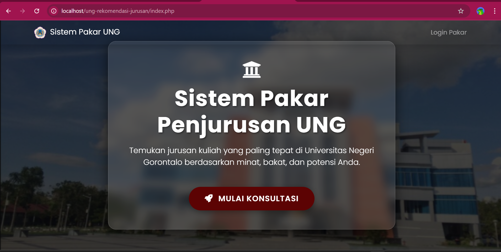

# Sistem Pakar Rekomendasi Jurusan UNG (PHP Native)


**Sistem Pakar Rekomendasi Jurusan** adalah aplikasi berbasis web yang dirancang untuk membantu calon mahasiswa Universitas Negeri Gorontalo (UNG) dalam menentukan jurusan yang paling sesuai dengan minat, bakat, dan potensi mereka. Sistem ini dibangun menggunakan metode **Forward Chaining** sederhana dengan PHP Native.

## 🌟 Fitur Utama

* **Sistem Pakar Cerdas:** Menggunakan aturan (rule-based) dinamis untuk mencocokkan minat user dengan prodi yang ada.
* **Database Seeder:** Script otomatis (`seed.php`) untuk mengisi data fakultas, jurusan, dan aturan pakar tanpa input manual satu per satu.
* **Antarmuka Modern:** Desain responsif menggunakan **Bootstrap 4** dengan efek animasi **AOS** dan **Glassmorphism**.
* **Struktur MVC:** Kode terorganisir rapi memisahkan *Logic* (Controller), *Tampilan* (Views), dan *Konfigurasi* (Config).

## 📂 Struktur Folder

Project ini disusun dengan struktur yang bersih:

```text
├── assets/          # File CSS, JS, dan Gambar (Logo UNG, Background)
├── config/          # Konfigurasi koneksi database
├── controller/      # Logika pemrosesan data (ExpertController.php)
├── database/        # Script SQL dan Seeding data (seed.php)
├── views/           # Tampilan antarmuka (Frontend)
├── index.php        # Entry point (Routing sederhana)
└── README.md        # Dokumentasi.
```  


## 🛠️ Prasyarat (Requirements)

```  
Sebelum menjalankan aplikasi, pastikan komputer Anda memiliki:

Web Server Local: XAMPP, Laragon, atau MAMP.

PHP Version: Minimal PHP 7.4 atau 8.x.

Database: MySQL/MariaDB.

Browser: Chrome, Firefox, atau Edge terbaru.

```  

## 🚀 Cara Instalasi & Menjalankan
Ikuti langkah-langkah berikut untuk menjalankan project ini di komputer lokal:

```  
1. Clone Repository
Buka terminal atau Git Bash, lalu clone repository ini ke folder htdocs (XAMPP) atau www (Laragon):

Bash

cd C:/laragon/www  # atau C:/xampp/htdocs
git clone [https://github.com/armanmursalig17/sistem-pakar-rekomendasi-jurusan-ung--php-nativ-.git](https://github.com/armanmursalig17/sistem-pakar-rekomendasi-jurusan-ung--php-nativ-.git) pakar-ung
2. Buat Database
Buka phpMyAdmin (http://localhost/phpmyadmin).

Buat database baru dengan nama: pakar_ung.

3. Konfigurasi Database (Opsional)
Jika password database Anda bukan kosong (default XAMPP/Laragon biasanya user: root, pass: kosong), buka file config/koneksi.php dan sesuaikan:

PHP

$host = "localhost";
$user = "root";      // Sesuaikan user
$pass = "password";  // Sesuaikan password jika ada
$db   = "pakar_ung";
4. Seeding Data (PENTING!)
Project ini memiliki fitur Auto Seeding yang hebat. Anda tidak perlu import file .sql manual. Cukup jalankan script ini di browser untuk membuat tabel dan mengisi ribuan aturan secara otomatis.

Nyalakan Apache & MySQL.

Buka browser dan akses: http://localhost/pakar-ung/database/seed.php

Tunggu hingga muncul pesan "Selesai! Database pakar_ung siap digunakan."

5. Jalankan Aplikasi
Setelah database terisi, kembali ke halaman utama: http://localhost/pakar-ung/

Klik tombol "Mulai Konsultasi" untuk mencoba sistem.

Untuk login pakar gunakan username = admin & password = password123
```

## 🤝 Kontribusi & Pengembangan
```
Project ini bersifat open-source dan terbuka untuk siapa saja yang ingin mempelajari, menggunakan, atau mengembangkannya lebih lanjut.
Silakan melakukan fork, modifikasi, dan pull request jika Anda ingin menambahkan fitur, memperbaiki bug, atau meningkatkan performa sistem.

Saya sangat menghargai setiap bentuk kontribusi demi membuat aplikasi ini semakin bermanfaat bagi calon mahasiswa UNG dan pengguna lainnya.
```
## 📷 Screenshots
Dokumentasi
 


 

## 👤 Author
Arman Mursali - Developer - GitHub Profile

Dibuat dengan ❤️ untuk Mahasiswa UNG.
